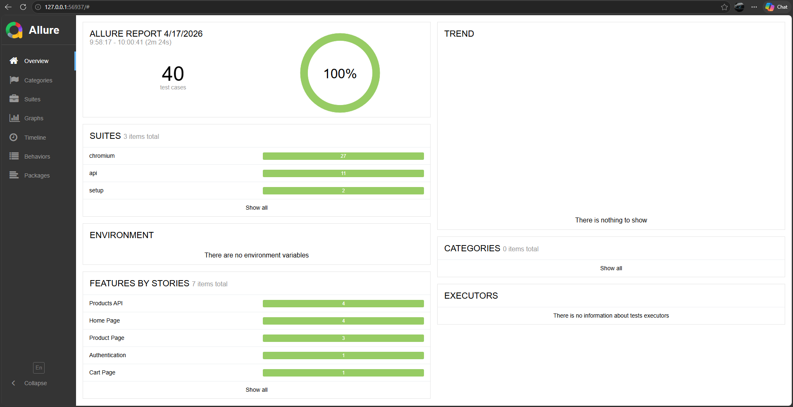
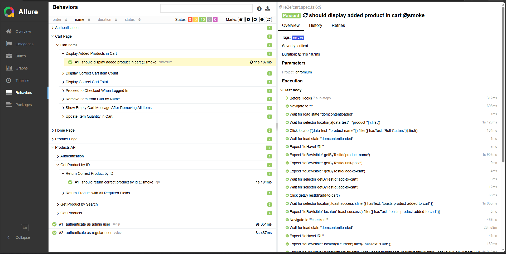
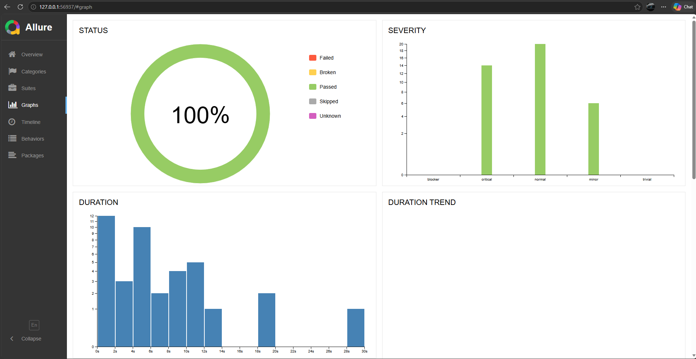
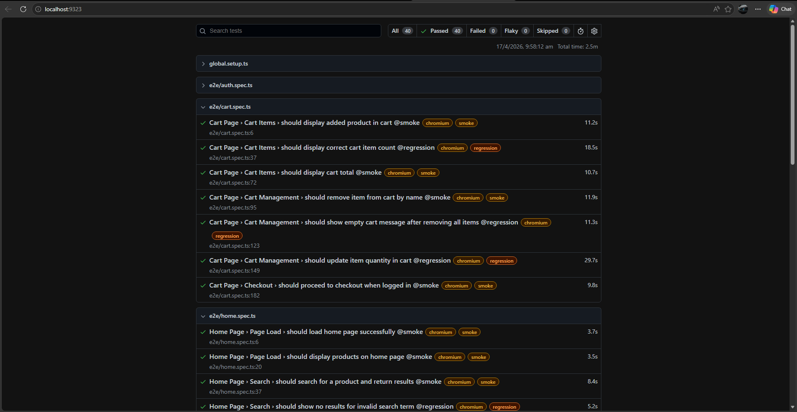
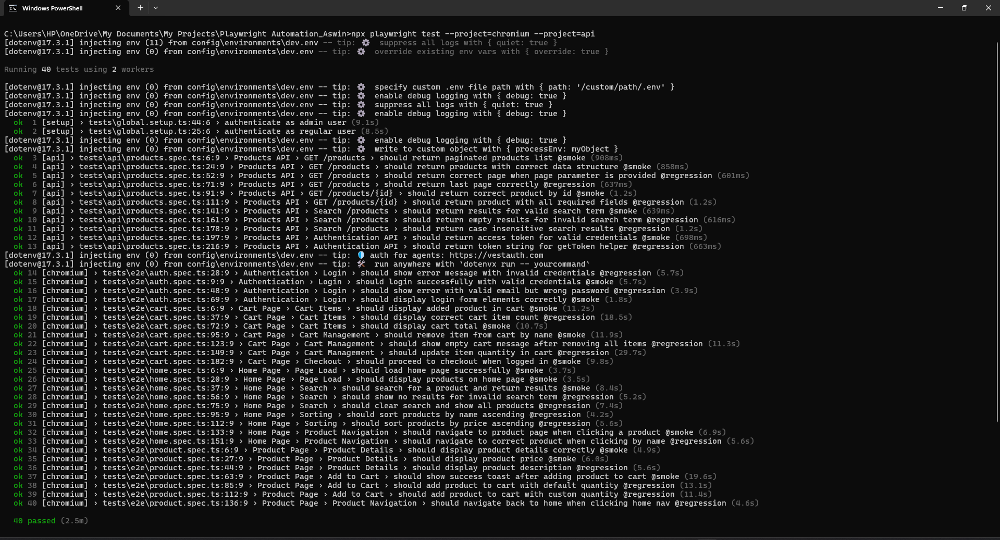
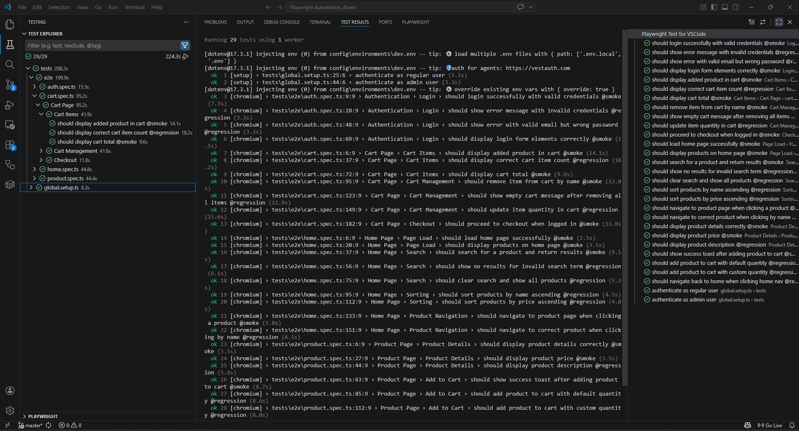

# 🛠️ Playwright Toolshop Framework

[](https://github.com/Ashwin1217/playwright-toolshop-framework/actions/workflows/playwright.yml)
[](https://www.typescriptlang.org/)
[](https://playwright.dev/)
[](https://nodejs.org/)
[](https://opensource.org/licenses/MIT)

An **enterprise-grade Playwright test automation framework** built with TypeScript for the [Practice Software Testing — Toolshop v5.0](https://practicesoftwaretesting.com) website.

Built as a portfolio project to demonstrate professional QA engineering skills — covering UI automation, API testing, Page Object Model, custom fixtures, CI/CD integration, and Allure reporting.

---

## 📋 Table of Contents

- [Tech Stack](#-tech-stack)
- [Project Structure](#-project-structure)
- [Getting Started](#-getting-started)
- [Running Tests](#-running-tests)
- [Test Coverage](#-test-coverage)
- [Framework Architecture](#-framework-architecture)
- [CI/CD Pipeline](#-cicd-pipeline)
- [Reporting](#-reporting)
- [Test Reports](#-test-reports)
- [CI Notes](#-ci-notes)

---

## 🧰 Tech Stack

| Tool                                          | Version | Purpose                     |
| --------------------------------------------- | ------- | --------------------------- |
| [Playwright](https://playwright.dev/)         | ^1.51.1 | Core test automation engine |
| [TypeScript](https://www.typescriptlang.org/) | ^5.8.3  | Type-safe test development  |
| [Node.js](https://nodejs.org/)                | v23.x   | Runtime environment         |
| [ESLint](https://eslint.org/)                 | ^9.x    | Code quality enforcement    |
| [Prettier](https://prettier.io/)              | ^3.x    | Code formatting             |
| [Husky](https://typicode.github.io/husky/)    | ^9.x    | Pre-commit hooks            |
| [Allure](https://allurereport.org/)           | ^3.x    | Test reporting              |
| [dotenv](https://github.com/motdotla/dotenv)  | latest  | Environment management      |

---

## 📁 Project Structure

```
playwright-toolshop-framework/
├── .github/
│   └── workflows/
│       └── playwright.yml          # CI/CD pipeline
├── config/
│   └── environments/
│       ├── dev.env                 # Dev credentials (gitignored)
│       ├── staging.env             # Staging credentials (gitignored)
│       └── prod.env                # Prod credentials (gitignored)
├── docs/
│   └── screenshots/                # Test report screenshots
│       ├── allure-dashboard.png
│       ├── allure-behaviors.png
│       ├── allure-graphs.png
│       ├── playwright-report.png
│       ├── playwright-list.png
│       └── test-results-terminal.png
├── src/
│   ├── api/                        # API client layer
│ │ ├── BaseApiClient.ts            # Abstract HTTP client
│ │ ├── AuthApiClient.ts            # Authentication API
│ │ ├── index.ts                    # Central export file
│ │ └── ProductsApiClient.ts        # Products API
│ ├── components/                   # Reusable UI components
│ │   ├── NavigationComponent.ts    # Navbar component
│ │   └── ToastComponent.ts         # Toast notification component
│ ├── fixtures/
│ │   └── index.ts                  # Custom Playwright fixtures
│ ├── pages/                        # Page Object Models
│ │   ├── BasePage.ts               # Abstract base page
│ │   ├── LoginPage.ts              # Login page
│ │   ├── HomePage.ts               # Home/product listing page
│ │   ├── ProductPage.ts            # Product detail page
│ │   └── CartPage.ts               # Shopping cart page
│ └── types/                        # TypeScript interfaces
│     ├── Auth.ts                   # Auth types
│     ├── Product.ts                # Product types
│     ├── index.ts                  # Central export file
│     └── User.ts                   # User types
├── test-data/
│   └── static/                     # Static test data
├── tests/
│   ├── api/
│ │ └── products.spec.ts             # API tests
│ ├── e2e/
│ │   ├── auth.spec.ts               # Authentication tests
│ │   ├── cart.spec.ts               # Cart management tests
│ │   ├── home.spec.ts               # Home page tests
│ │   └── product.spec.ts            # Product detail tests
│ └── global.setup.ts                # Authentication state setup
├── .env.example                     # Environment variable template
├── playwright.config.ts             # Playwright configuration
└── tsconfig.json                    # TypeScript configuration

```

---

## 🚀 Getting Started

### Prerequisites

- Node.js v18 or higher
- npm v9 or higher
- Git

### Installation

```bash
# Clone the repository
git clone https://github.com/Ashwin1217/playwright-toolshop-framework.git
cd playwright-toolshop-framework

# Install dependencies
npm install

# Install Playwright browsers
npx playwright install
```

### Environment Setup

```bash
# Copy the example env file
cp .env.example config/environments/dev.env

# Fill in your credentials
# Edit config/environments/dev.env with real values
```

Required environment variables:
BASE_URL=https://practicesoftwaretesting.com
API_BASE_URL=https://api.practicesoftwaretesting.com
ENV=dev
TEST_USER_EMAIL=your-test-email@example.com
TEST_USER_PASSWORD=your-password
TEST_USER_FIRST_NAME=FirstName
TEST_USER_LAST_NAME=LastName
ADMIN_USER_EMAIL=your-admin-email@example.com
ADMIN_USER_PASSWORD=your-admin-password
ADMIN_USER_FIRST_NAME=AdminFirst
ADMIN_USER_LAST_NAME=AdminLast

> **Note:** Use the publicly available Toolshop test credentials from [practicesoftwaretesting.com](https://practicesoftwaretesting.com)

---

## 🧪 Running Tests

### Run all tests

```bash
npx playwright test --project=chromium --project=api
```

### Run by tag

```bash
# Smoke tests only (fast — ~3 minutes)
npx playwright test --grep @smoke

# Regression tests only
npx playwright test --grep @regression
```

### Run by project

```bash
# UI tests only
npx playwright test --project=chromium

# API tests only
npx playwright test --project=api
```

### Run specific test file

```bash
npx playwright test tests/e2e/auth.spec.ts
npx playwright test tests/e2e/cart.spec.ts
npx playwright test tests/api/products.spec.ts
```

### Run against different environments

```bash
ENV=staging npx playwright test
ENV=prod npx playwright test
```

### Interactive UI mode

```bash
npx playwright test --ui
```

### View HTML report

```bash
npx playwright show-report reports/html
```

### Generate and view Allure report

```bash
npm run allure:generate
npm run allure:open
```

---

## 📊 Test Coverage

### Test Summary

| Suite          | Tests  | Tags                |
| -------------- | ------ | ------------------- |
| Authentication | 4      | @smoke, @regression |
| Home Page      | 9      | @smoke, @regression |
| Product Page   | 7      | @smoke, @regression |
| Cart Page      | 7      | @smoke, @regression |
| Products API   | 11     | @smoke, @regression |
| **Total**      | **40** |                     |

### Coverage Areas

**UI Tests (29)**

- ✅ User authentication — login, error handling, form validation
- ✅ Product search and filtering
- ✅ Product sorting (name, price)
- ✅ Product detail page — details, pricing, add to cart
- ✅ Shopping cart — add, remove, update quantity, checkout

**API Tests (11)**

- ✅ Products listing with pagination
- ✅ Product data structure validation
- ✅ Search functionality
- ✅ Authentication token generation

---

## 🏗️ Framework Architecture

### Page Object Model

Every page of the application is represented as a TypeScript class. Locators are properties, actions are methods. Tests never interact with the browser directly.

```typescript
// Tests use Page Objects — never raw Playwright
await homePage.navigate();
await homePage.searchForProduct('hammer');
await homePage.assertSearchResultsContain('hammer');
```

### Component Objects

Reusable UI elements extracted as separate classes, composed into pages.

```typescript
// NavigationComponent and ToastComponent
await productPage.nav.assertUserIsLoggedIn();
await productPage.toast.assertSuccessMessage('Product added to shopping cart');
```

### Custom Fixtures

Page objects and API clients automatically injected into tests — no manual instantiation.

```typescript
// Fixtures injected automatically — no setup boilerplate
test('add to cart', async ({ homePage, productPage, cartPage }) => {
  await homePage.navigate();
  await homePage.clickProductByName('Bolt Cutters');
  await productPage.addToCart();
  await cartPage.navigate();
  await cartPage.assertItemInCart('Bolt Cutters');
});
```

### API Client Layer

Typed API clients for direct backend testing and test data setup.

```typescript
const products = await productsApiClient.getProducts({ page: 1 });
const token = await authApiClient.getToken(email, password);
```

### TypeScript Types

All API responses are fully typed — autocomplete and compile-time safety throughout.

```typescript
const product: Product = await productsApiClient.getProductById(id);
product.name; // ✅ TypeScript knows this is a string
product.price; // ✅ TypeScript knows this is a number
product.xyz; // ❌ TypeScript error — doesn't exist
```

---

## 🔄 CI/CD Pipeline

### Pipeline Overview

```
Push / PR to master
         ↓
┌─────────────────────┐
│   Smoke Tests Job   │  ← Runs on every push and PR
│   API @smoke tests  │  ← Must pass
│   UI @smoke tests   │  ← Best-effort (Cloudflare)
└─────────────────────┘
         ↓ (master push only)
┌─────────────────────┐
│ Regression Tests Job│  ← Runs on merge to master
│   All API tests     │  ← Must pass
│   All UI tests      │  ← Best-effort (Cloudflare)
│   Allure report     │  ← Uploaded as artifact
└─────────────────────┘
```

### Scheduled Runs

Tests run automatically every weekday at 6 AM UTC to catch environment drift.

### GitHub Secrets Required

BASE_URL, API_BASE_URL, ENV
TEST_USER_EMAIL, TEST_USER_PASSWORD
TEST_USER_FIRST_NAME, TEST_USER_LAST_NAME
ADMIN_USER_EMAIL, ADMIN_USER_PASSWORD
ADMIN_USER_FIRST_NAME, ADMIN_USER_LAST_NAME

---

## 📈 Reporting

### Playwright HTML Report

```bash
npx playwright show-report reports/html
```

Built-in Playwright report with test steps, screenshots on failure, and trace viewer.

### Allure Report

```bash
npm run allure:generate
npm run allure:open
```

Professional interactive report with:

- Test categorization by Epic → Feature → Story
- Severity levels (critical, normal, minor)
- Owner attribution
- Step-by-step execution timeline
- Screenshots and traces embedded

---

## 📸 Test Reports

### Allure Report




### Playwright HTML Report  


### Playwright List Report  


### Test Run Terminal Output


---

## ⚠️ CI Notes

UI tests require a non-datacenter IP due to Cloudflare bot protection on the Toolshop practice site. In CI (GitHub Actions), UI tests run with `continue-on-error: true` — API tests are the reliable CI gate.

See [CI_NOTES.md](./CI_NOTES.md) for full details and enterprise solutions.

---

## 📝 License

MIT © [Aswin](https://github.com/Ashwin1217)
